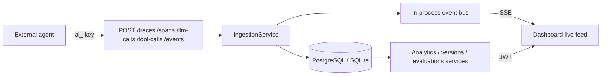

# Architecture

AgentLens is a monorepo observability, evaluation, and monitoring platform for AI
agents. External agents send structured traces through an SDK; the dashboard
reads them back as execution trees, analytics, evaluation scores, and version
comparisons.

## Components

### Frontend (`apps/web`)

Next.js App Router application:

| Route | Purpose |
|-------|---------|
| `/` | Marketing landing page |
| `/login`, `/signup`, `/forgot-password`, `/reset-password` | Authentication |
| `/dashboard` | KPIs and analytics charts for the current organization |
| `/traces`, `/traces/[id]` | Trace list with a live feed, and the span waterfall explorer |
| `/evaluations`, `/evaluations/[id]` | Datasets, evaluators, runs, and run comparison |
| `/versions` | Version rollups and regression checks |
| `/projects`, `/projects/[id]` | Projects and API keys |
| `/settings` | Profile, organization, members, and platform health |

Server state is managed with TanStack Query. Auth tokens live in `localStorage`
and are attached by a thin `apiFetch` wrapper in `src/lib/api.ts`.

### Backend (`apps/api`)

FastAPI service:

- REST API under `/api/v1` with OpenAPI docs at `/docs`
- JWT access/refresh tokens for dashboard users, hashed `al_…` API keys for SDK ingestion
- SQLAlchemy 2.0 async ORM over PostgreSQL, or SQLite for local development
- Redis for refresh-token revocation and password-reset tokens, with an in-process
  fallback store so the API runs without Redis installed
- Alembic migrations in `apps/api/alembic/`

### Workers (`workers`)

Background job processor connected to Redis. Currently a health-check loop:
ingestion, evaluation, and analytics all run inline in the API request path, which
is simpler to reason about and fast enough at this scale. Long-running evaluation
sweeps are the natural first job to move here.

### SDK (`packages/python-sdk`)

Zero-dependency-beyond-`httpx` Python client. Context managers for traces, spans,
LLM calls, and tool calls; an `@observe` decorator; dataset upload and fetch; and
`evaluate()` / `evaluate_traces()` for scoring. See [sdk.md](sdk.md).

## Request flow



## Data model

```text
User ──< OrganizationMember >── Organization ──< Project
                                                  │
                    ┌─────────────────────────────┼──────────────────────────┐
                    │                             │                          │
                  ApiKey                        Agent                    Dataset ──< DatasetItem
                                                  │                          │
                                                Trace                     Evaluator
                                                  │                          │
                        ┌────────────┬────────────┼──────────┐               │
                      Span        Event      (aggregates)    │       EvaluationRun ──< EvaluationResult
                        │                                    │
                ┌───────┴───────┐                            │
             LLMCall        ToolCall                   PromptVersion
```

Every child row also carries `project_id`. That denormalisation lets every query
filter by tenant directly instead of joining up the tree, which is what makes
cross-tenant leaks structurally hard rather than merely unlikely.

Traces, spans, LLM calls, and tool calls are **upserted by id**, so an agent can
open a run with `status=running` and complete it later. Trace token totals, cost,
and duration are recomputed from child rows on every write, so a trace is always
consistent with its spans.

Cost is estimated at ingestion time from a model price table
(`app/core/pricing.py`) rather than trusted from the client.

## Time windows and percentiles

Analytics buckets are produced with `date_trunc` on PostgreSQL and `strftime` on
SQLite, then empty buckets are filled in Python so charts have no gaps. Latency
percentiles are computed in the API from sampled durations, so results do not
depend on database-specific percentile functions.

## Real-time updates

Ingestion handlers publish compact payloads to an in-process pub/sub bus
(`app/core/events.py`). The dashboard subscribes over server-sent events at
`GET /api/v1/projects/{id}/stream?token=…`; `EventSource` cannot set headers, so
the access token travels as a query parameter over the same TLS channel as the
rest of the API. Authorization runs in a short-lived session that closes before
streaming begins, so an idle browser tab never pins a database connection.

Subscriber queues are bounded and drop their oldest event under back-pressure, so
a slow browser can never stall ingestion. Events are published after a successful
write but before the request-scoped commit, so a live tile can very occasionally
show a row from a transaction that later rolls back; the trace explorer always
reads from the database, so the persisted view stays authoritative.

The bus is per-process. A multi-worker deployment needs a shared broker (Redis
pub/sub) for a browser connected to worker A to see ingest that landed on worker
B.

## Self-observability

`ObservabilityMiddleware` stamps every response with `X-Request-ID` and
`X-Response-Time` and records the outcome in an in-process metrics registry
(`app/core/observability.py`): request counts, 4xx/5xx counts, and latency
percentiles per route template. `RequestGuardMiddleware` enforces a body-size
limit and a sliding-window rate limit ahead of routing.

Exposed at:

- `GET /api/v1/system/info` — build, backends, judge configuration, uptime
- `GET /api/v1/system/metrics` — JSON snapshot including live-stream stats
- `GET /api/v1/system/metrics/prometheus` — text exposition format
- `GET /api/v1/organizations/{org_id}/usage` — per-workspace row counts and 24h volume
- `GET /health`, `GET /health/ready` — the latter checks the database and returns 503 when it is down

The dashboard renders all of this on `/settings` under **Platform health**.

Metrics are per-process and reset on restart, which is the right trade-off for a
single-node deployment and the reason the Prometheus endpoint exists for anything
larger.

## Security model

- Passwords hashed with bcrypt; refresh tokens revocable through Redis
- API key secrets shown once, stored as SHA-256 hashes, prefix kept for display
- Every service method scopes queries by organization or project
- Security headers on every response: `X-Content-Type-Options`, `X-Frame-Options`,
  `Referrer-Policy`, and HSTS when `ENVIRONMENT=production`
- Rate limiting and request body caps are configurable and enabled by default
- CORS restricted to `CORS_ORIGINS`

## Trade-offs worth knowing

| Decision | Why | Cost |
|----------|-----|------|
| Evaluations run inline in the request | Simple, no job plumbing, immediate results | Long sweeps hold a connection open |
| In-process event bus and metrics | No extra infrastructure to run locally | Needs a shared broker to scale past one worker |
| Cost estimated from a static price table | Deterministic and provider-independent | Table needs updating as prices change |
| `project_id` denormalised onto every row | Cheap tenant-scoped queries | Extra column to keep consistent on write |
